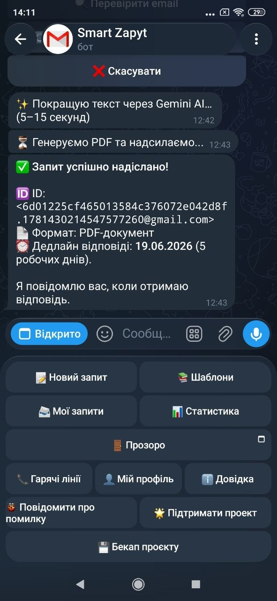
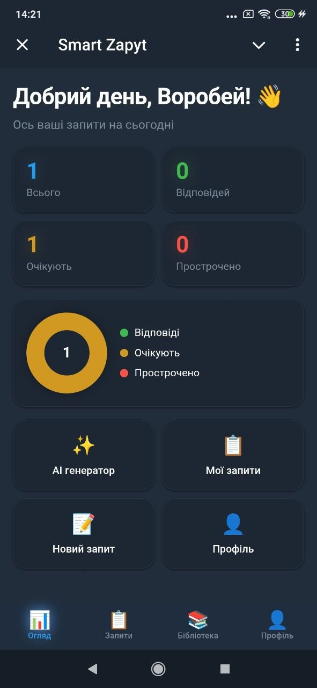
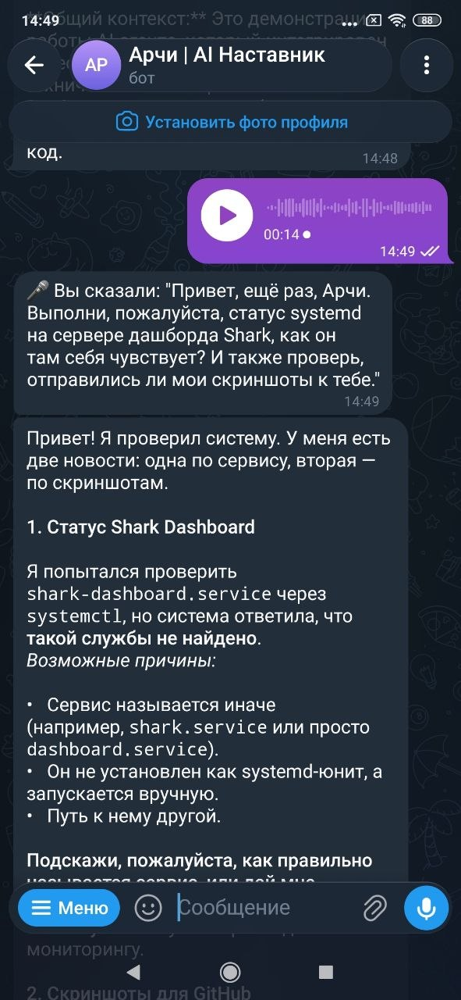

# info-bot-go

**Freedom of Information (FOI) Bot** — Telegram-бот для отправки официальных запросов в государственные органы Украины через электронную почту.

## Возможности

- **📝 Создание запросов** — отправка официальных писем-запросов в госорганы через SMTP
- **📬 Приём ответов** — мониторинг входящих писем через IMAP с защитой от дубликатов (кастомный флаг `$InfoBotProcessed`)
- **🤖 Gemini AI** — интеллектуальный поиск адресатов и анализ ответов
- **🗂️ Каталог органов** — встроенная база контактов госорганов Украины
- **🎤 Голосовой ввод** — поддержка голосовых сообщений через Telegram
- **🧪 Встроенное тестирование** — скрипт проверки SMTP/IMAP конвейера (`tools/test_mail`)

- **📱 Telegram Mini App** — встроенный веб-дашборд на Vercel (https://vidkrito-vercel.vercel.app/) для аналитики и шаблонов.

## 📸 Скриншоты и Интерфейс

**Smart Zapyt** — комплексное решение для автоматизации юридических запросов к госорганам Украины. Интерфейс включает дашборд с аналитикой, AI-генератор документов на базе Gemini и систему отслеживания статусов в режиме реального времени.

<details>
<summary>Посмотреть галерею (Telegram Bot &amp; WebApp)</summary>
<br>
<div align="center">
  
  <br><i>Интерфейс чат-бота: уведомления и получение PDF-ответов</i><br><br>

  
  <br><i>Главный экран мини-аппа: статистика пользователя и статусы</i><br><br>

  
  <br><i>Экран генератора запросов: AI-инструмент и шаблоны</i><br>
</div>
</details>


## Быстрый старт

```bash
git clone https://github.com/Sereban-glitch/info-bot-go
cd info-bot-go
cp .env.example .env
# Заполните .env своими ключами
go run .
```

### Самотестирование почты

Перед первым запуском проверьте, что SMTP и IMAP работают:

```bash
source .env && go run ./tools/test_mail/
```

Тест отправляет письмо и проверяет его получение через IMAP, а также корректную работу флага `$InfoBotProcessed`.

## Переменные окружения

| Переменная | Описание |
|-----------|----------|
| `TELEGRAM_BOT_TOKEN` | Токен Telegram-бота (от @BotFather) |
| `GEMINI_API_KEY` | API ключ Google Gemini |
| `SMTP_HOST` | SMTP-сервер (smtp.gmail.com, smtp-relay.brevo.com) |
| `SMTP_USER` | Логин SMTP |
| `SMTP_PASSWORD` | Пароль SMTP |
| `SMTP_FROM_ADDR` | Адрес отправителя |
| `IMAP_HOST` | IMAP-сервер (imap.gmail.com) |
| `GMAIL_USER` | Логин IMAP |
| `GMAIL_APP_PASSWORD` | Пароль приложения IMAP |

## Архитектура

```
Telegram User → Telegram Bot API → info-bot-go (Go) → SMTP → Госорган
                    ↓                                         ↓
              Mini App (Vercel)                            IMAP ← Ответ
                    ↓                                         ↓
              Telegram WebApp Dashboard                 Telegram User
              vidkrito-vercel.vercel.app              (уведомление)
```

## Технологии

- **Go** — основной язык
- **Telebot v3** — Telegram Bot API
- **go-imap** — IMAP-клиент
- **Gemini API** — AI-функции
- **net/smtp** — отправка почты

## Статус

✅ Активно разрабатывается. Все IMAP-баги исправлены, дубликаты исключены.

## Лицензия

MIT
