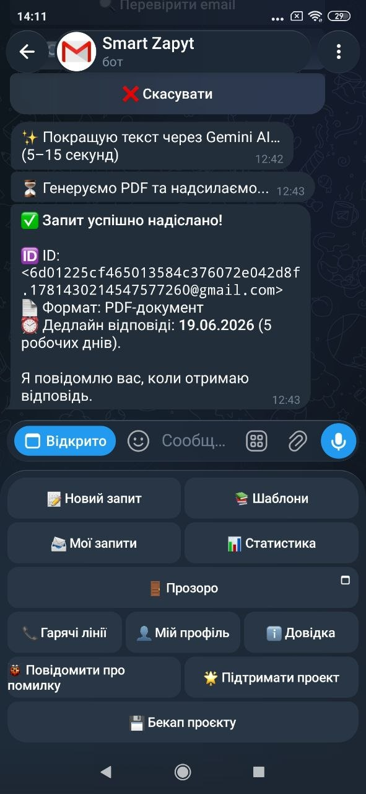
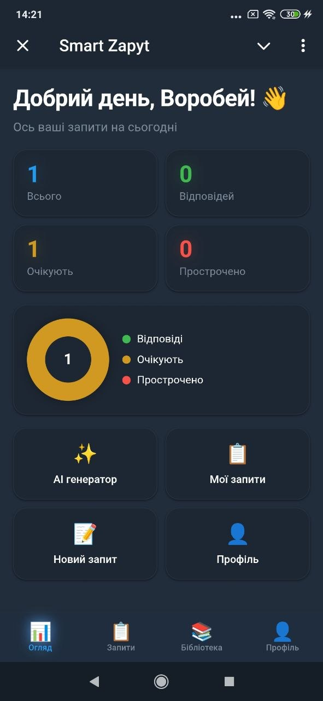

# info-bot-go

[](LICENSE)
[](https://golang.org)
[](https://t.me/Infozaputbot)
[](https://github.com/Sereban-glitch/info-bot-go/releases)

**Freedom of Information (FOI) Bot** — Telegram-бот для официальных запросов
в государственные органы Украины. Два канала доставки: прямая отправка по
электронной почте и публичный портал
[Доступ до правди (dostup.org.ua)](https://dostup.org.ua).

## 🌐 Канал «Доступ до правди»

Запросы подаются через публичный портал [dostup.org.ua](https://dostup.org.ua)
(~2150 госорганов Украины): запрос публикуется на портале, доставляется органу
напрямую и получает публичную страницу отслеживания с дедлайном ответа —
публичность добавляет давления.

Бот умеет отслеживать статусы запросов на портале, обновлять их и при
неуверенном ответе органа — **автоматически классифицировать статус**
(rejected / partially_successful / successful и т.д.), чтобы аккаунт не
блокировался порталом из-за неклассифицированных ответов.

Для включения добавьте в `.env`:

```env
DOSTUP_EMAIL=your_account@example.com
DOSTUP_PASSWORD=your_password
```

Полное описание протокола портала (для ИИ-агентов и портирования на другие
языки): [DOSTUP_INTEGRATION.md](DOSTUP_INTEGRATION.md). Реализация — пакет
`internal/dostup` (чистая стандартная библиотека Go, без зависимостей).

## 💡 Концепция

Не нужно составлять бумажные заявления, искать адресата, идти на почту и
стоять в очередях. Со **Smart Zapyt** весь процесс сводится к одному
действию: **запишите голосовое сообщение (30 секунд)** — AI-агент сам
сформулирует юридически грамотный текст, найдёт правильный госорган в базе
и отправит запрос. Сэкономленное время потратьте на жизнь, а не на очереди!

## Возможности

- **📝 Создание запросов** — подача официальных запросов через SMTP (email) или портал dostup.org.ua
- **📬 Приём ответов** — мониторинг входящих писем через IMAP, защита от дубликатов (кастомный флаг `$InfoBotProcessed`)
- **🤖 Gemini AI** — поиск адресатов, юридически грамотные формулировки и анализ ответов; разбор отказов органа с вердиктом
- **🗂️ Каталог органов** — встроенная база контактов госорганов Украины
- **📊 Отслеживание статусов** — синхронизация с порталом, обновление и автоклассификация статусов запросов
- **🎤 Голосовой ввод** — поддержка голосовых сообщений через Telegram
- **📱 Telegram Mini App** — встроенный PWA-дашборд (аналитика, статусы, шаблоны), раздаётся самим ботом на собственном сервере
- **🧪 Встроенное тестирование** — скрипт проверки SMTP/IMAP конвейера (`tools/test_mail`)

## 📸 Скриншоты

<div align="center">
  
  <br><i>Интерфейс чат-бота: уведомления и получение PDF-ответов</i><br><br>

  
  <br><i>Главный экран мини-аппа: статистика пользователя и статусы</i><br><br>
</div>

## 🚀 Быстрый старт

### Вариант 1: Готовый бинарник (рекомендуется)

```bash
# Linux amd64
wget https://github.com/Sereban-glitch/info-bot-go/releases/latest/download/info-bot-linux-amd64
chmod +x info-bot-linux-amd64
./info-bot-linux-amd64
```

### Вариант 2: Сборка из исходников

```bash
git clone https://github.com/Sereban-glitch/info-bot-go.git
cd info-bot-go
cp .env.example .env   # заполнить свои ключи
go build -o info-bot .
./info-bot
```

### Вариант 3: Docker (сборка образа из исходников)

```bash
docker build -t info-bot .
docker run -d --name info-bot -p 8081:8081 --env-file .env info-bot
```

### Самотестирование почты

Перед первым запуском проверьте, что SMTP и IMAP работают:

```bash
source .env && go run ./tools/test_mail/
```

Тест отправляет письмо и проверяет его получение через IMAP, а также корректную
работу флага `$InfoBotProcessed`.

## Переменные окружения

Полный список — в [`.env.example`](.env.example). Основные:

| Переменная | Описание |
|-----------|----------|
| `TELEGRAM_BOT_TOKEN` | Токен бота от @BotFather |
| `GEMINI_API_KEY` | API ключ Google Gemini |
| `SMTP_HOST`, `SMTP_PORT` | SMTP-сервер (smtp.gmail.com, smtp-relay.brevo.com) |
| `SMTP_USER`, `SMTP_PASSWORD`, `SMTP_FROM_ADDR` | Учётные данные SMTP-отправителя |
| `IMAP_HOST`, `IMAP_PORT` | IMAP-сервер (imap.gmail.com) |
| `GMAIL_USER`, `GMAIL_APP_PASSWORD` | Учётные данные IMAP |
| `DOSTUP_EMAIL`, `DOSTUP_PASSWORD` | Аккаунт dostup.org.ua (канал портала) |

## Архитектура

```
Telegram User → Telegram Bot API → info-bot-go (Go) → SMTP → Госорган
                                            │            │
                                            │            └→ dostup.org.ua (портал)
                                            ↓
                                      Mini App (PWA)
                                      раздаётся ботом :8081 (собственный сервер)
```

```

## Технологии

- **Go** — основной язык (один статический бинарник)
- **Telebot v3** — Telegram Bot API
- **go-imap** — IMAP-клиент
- **Gemini API** — AI-функции
- **net/smtp** — отправка почты

## 🤖 Работа с ИИ-агентами: навык проекта

Для обслуживания бота (сборка, деплой, релизы на GitHub, интеграция с
dostup.org.ua) создан **навык для ИИ-агентов** (OpenCode/Claude):

- **Путь в репозитории:** `.opencode/skills/info-bot/SKILL.md`
- **Что внутри:** карта проекта, проверенные команды сборки/деплоя,
  механика GitHub Release («бэкап версии»), авто-деплой через GitHub Actions,
  знания по Alaveteli (блокировка аккаунта, CSRF-токены, классификация
  статусов, автоклассификация).

**С любого устройства:**

1. Клонируйте репозиторий — при работе внутри папки проекта навык
   подхватывается автоматически (проектный навык):
   ```bash
   git clone https://github.com/Sereban-glitch/info-bot-go.git
   cd info-bot-go   # opencode сам увидит .opencode/skills/info-bot/
   ```
2. Нужен доступ к боевому серверу: SSH-алиас `agrobot-prod`
   (ключи — в `~/.ssh/`) и клон исходников `/home/archi/info-bot-src`
   на сервере. Параметры доступа описаны в самом навыке.
3. Если навык нужен глобально (вне папки репо) — скопируйте его в
   системную папку навыков:
   ```bash
   mkdir -p ~/.config/opencode/skills
   cp -r .opencode/skills/info-bot ~/.config/opencode/skills/
   ```

## Статус

✅ Активно разрабатывается. Авто-деплой: пуш в `main` → сборка и развёртывание
на сервере через GitHub Actions. Теги `v*` → релиз с бинарниками.

## Лицензия

MIT